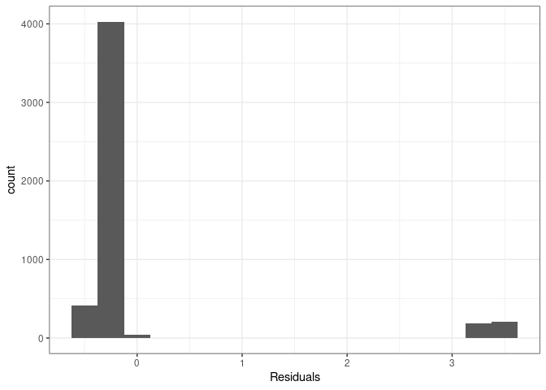

Activity 7 - Linear Discriminant Analysis
================

## Libraries

``` r
library(tidyverse)
library(tidymodels)
```

## Loading the Data

``` r
resume <- read.csv("https://www.openintro.org/data/csv/resume.csv")
```

## LDA

``` r
# Convert received_callback to a factor with more informative labels
resume <- resume %>% mutate(received_callback = factor(received_callback, labels = c("No", "Yes")))


# LDA
library(discrim)
```

    ## 
    ## Attaching package: 'discrim'

    ## The following object is masked from 'package:dials':
    ## 
    ##     smoothness

``` r
lda_years <- discrim_linear() %>% 
  set_mode("classification") %>% 
  set_engine("MASS") %>% 
  fit(received_callback ~ log(years_experience), data = resume)

lda_years
```

    ## parsnip model object
    ## 
    ## Call:
    ## lda(received_callback ~ log(years_experience), data = data)
    ## 
    ## Prior probabilities of groups:
    ##         No        Yes 
    ## 0.91950719 0.08049281 
    ## 
    ## Group means:
    ##     log(years_experience)
    ## No               1.867135
    ## Yes              1.998715
    ## 
    ## Coefficients of linear discriminants:
    ##                            LD1
    ## log(years_experience) 1.638023

The `group mean` for resumes that received a call back is higher than
resumes that did not receive a call back. The `group mean` is comparing
the peaks of each density plot.

## Predictions

This outputs a long list of predictions so this must be consolidated
into a confusion matrix.

``` r
predict(lda_years, new_data = resume, type = "prob")
```

    ## # A tibble: 4,870 × 2
    ##    .pred_No .pred_Yes
    ##       <dbl>     <dbl>
    ##  1    0.923    0.0769
    ##  2    0.923    0.0769
    ##  3    0.923    0.0769
    ##  4    0.923    0.0769
    ##  5    0.884    0.116 
    ##  6    0.923    0.0769
    ##  7    0.928    0.0724
    ##  8    0.885    0.115 
    ##  9    0.939    0.0612
    ## 10    0.923    0.0769
    ## # … with 4,860 more rows

The confusion matrix shows us that every record was classified as not
getting a call back.

``` r
augment(lda_years, new_data = resume) %>% 
  conf_mat(truth = received_callback, estimate = .pred_class)
```

    ##           Truth
    ## Prediction   No  Yes
    ##        No  4478  392
    ##        Yes    0    0

The accuracy represents the probability of a record being a `no`.

``` r
augment(lda_years, new_data = resume) %>% 
  accuracy(truth = received_callback, estimate = .pred_class)
```

    ## # A tibble: 1 × 3
    ##   .metric  .estimator .estimate
    ##   <chr>    <chr>          <dbl>
    ## 1 accuracy binary         0.920

## Challenge: Fit another model

Creating a linear model using the log() of `years_experience`.

``` r
resume <- read.csv("https://www.openintro.org/data/csv/resume.csv")
lm_years <- lm(received_callback ~ log(years_experience), data = resume)
```

``` r
aug_lm_years <- augment(lm_years)
```

``` r
resume %>% 
  ggplot(aes(x=received_callback, y=log(years_experience))) +
  geom_smooth(method = "lm", se = FALSE) +
  geom_point() + 
  theme_bw()
```

    ## `geom_smooth()` using formula 'y ~ x'

<!-- -->

``` r
ggplot(data = aug_lm_years, aes(x = .fitted, y = .std.resid)) +
  geom_point() +
  geom_hline(yintercept = 0, linetype = "dashed", color = "red") +
  xlab("Fitted values") +
  ylab("Residuals") + 
  theme_bw()
```

<!-- -->

``` r
ggplot(data = aug_lm_years, aes(x = .std.resid)) +
  geom_histogram(binwidth = 0.25) +
  xlab("Residuals") + 
  theme_bw()
```

<!-- -->
